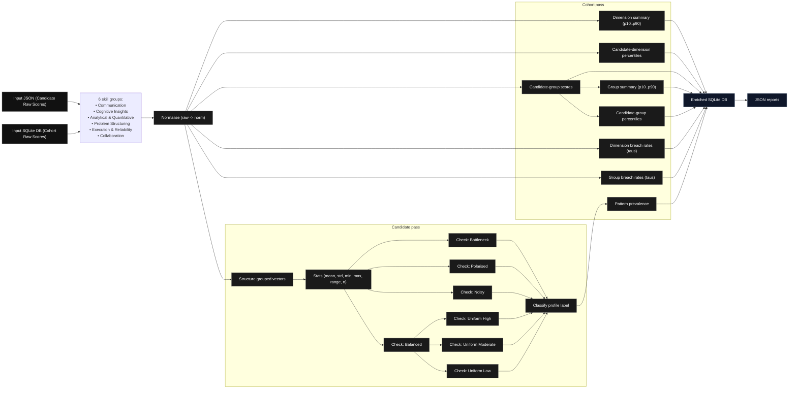

# Profile Pattern Diagnostics

Profile Pattern Diagnostics (PPD) is a diagnostic framework for analysing the internal structure of rubric-based, multi-dimensional skill profiles. It is designed to describe how a profile is shaped—its balance, internal tensions, and concentration patterns—without producing rankings, predictions, or recommendations.

PPD treats skill assessments as structured vectors rather than scores to be optimised. The system focuses on interpretability, assessor stability, and internal coherence, making it suitable for analytical inspection of profiles at both individual (candidate) and aggregate (cohort) levels.

## Availability

The source code for this project is publicly accessible with permission from the owning organisation, subject to scope and usage constraints.

This repository documents the problem framing, methodological design, and analytical structure of the Profile Pattern Diagnostics (PPD) system, which was developed by me and delivered as part of a commercial engagement within an HR and consulting organisation I was affiliated with in 2021.

## Purpose and motivation

Most skill evaluation systems collapse rich, multi-axis assessments into single scores, rankings, or opaque model outputs. This obscures structural information such as uneven development, bottlenecks, or polarised strengths.

PPD exists to preserve that structure.

The framework provides a formal, transparent way to:

- describe the shape of a skill profile,
- detect internal imbalances and constraints,
- contextualise an individual profile relative to a cohort,
- and do so without embedding decision logic or normative judgement.

PPD is explicitly diagnostic, not prescriptive.

## What PPD is not

PPD is intentionally limited in scope. It is:

- not a hiring or screening tool
- not a predictive or machine-learning model
- not a ranking or scoring system
- not a decision engine or recommender

Any downstream interpretation or use of PPD outputs must occur outside the framework itself.

## Installation

### Install from GitHub

```bash
pip install git+https://github.com/PaiSuryaDarshan/profile-pattern-diagnostics.git
```

This installs the package and makes the ppd command-line interface available in your environment.

## Example usage

PPD is operated via a command-line interface.

### Candidate-level analysis

PPD can be used to analyse the internal structure of an individual candidate profile independently of cohort context.

```bash
ppd candidate \
  --input "<INPUT_PATH>" \
  --output "<OUTPUT_PATH>"
```

or Batch Evaluation of profiles can be performed using a simple shell loop:

```bash
for f in <INPUT_FOLDER>/*.json; do
  ppd candidate \
    --input "$f" \
    --output "<OUTPUT_FOLDER>/$(basename "${f%.json}")_report.json"
done
```

or can be retrieved individually from cohort SQLite3 database during visualisation.

This command evaluates a single rubric-based skill profile and produces a structured diagnostic report.

#### What this analysis does

For a given candidate input, PPD performs the following steps:

- ingests rubric-based scores across all defined skill dimensions,
- normalises scores to a unit interval to ensure scale consistency,
- groups dimensions into predefined skill groups,
- computes order-invariant structural descriptors for each group, including:

  - mean level,
  - dispersion and internal variability,
  - extrema and contrast,

- evaluates fixed diagnostic thresholds to identify structural patterns such as:
  - bottlenecks,
  - polarisation,
  - imbalance or noise,
  - uniformly high, moderate, or low profiles.

The resulting profile labels are descriptive, not evaluative.
Multiple labels may apply simultaneously.

### Cohort-level analysis

The example below runs a cohort analysis from an input file containing rubric-based skill profiles:

```bash
ppd cohort-materialise \
  --input "<INPUT_PATH>" \
  --output "<OUTPUT_PATH>"
```

This command performs the following, in sequence:

- ingests rubric-based candidate data from the specified input file,
- normalises all scores to a unit interval,
- structures dimensions into predefined skill groups,
- computes cohort-level distribution summaries and percentiles,
- evaluates fixed diagnostic thresholds,
- generates structured diagnostic outputs.

The analysis is descriptive and deterministic.
No ranking, prediction, or decision logic is applied.

### Notes

The input file is expected to follow the schema defined in the repository documentation.

Identical inputs will always produce identical outputs.

Cohort analysis does not alter candidate-level semantics.

## High-level system overview



The PPD pipeline operates on two aligned inputs:

1. Candidate-level raw rubric scores
2. Cohort-level raw rubric scores (used for contextual statistics)

Both inputs are processed through a shared normalisation and structuring stage before diverging into candidate-specific and cohort-level analyses.

At a high level, the system performs:

- deterministic normalisation of rubric scores to a unit interval,
- grouping of dimensions into semantically defined skill groups,
- extraction of order-invariant statistical descriptors,
- rule-based detection of structural patterns,
- optional cohort contextualisation via percentiles and prevalence rates.

The output is a structured diagnostic report, not a verdict.

## Input assumptions

All inputs are assumed to be:

- rubric-based scores on a fixed ordinal scale (e.g. 0–5),
- assessor-assigned (human or procedural),
- grouped into predefined skill dimensions and higher-level groups.

No learning or fitting occurs inside PPD.

## Candidate-level analysis

At the candidate level, PPD analyses the internal structure of a single profile.

After normalisation and grouping, the framework computes a set of order-invariant descriptors for each group, including:

- central tendency (mean),
- dispersion (population standard deviation),
- extrema (minimum and maximum),
- range and internal contrast,
- z-scores (magnitude of distortion from mean)
- local volatility measures (applied only with ordered groups).

These descriptors are then evaluated against fixed, pre-declared thresholds to detect structural patterns such as:

- bottlenecks (persistent low minima),
- polarisation (simultaneous high maxima and low minima),
- noisy or uneven distributions,
- balanced profiles,
- uniformly high, moderate, or low profiles.

Pattern labels are descriptive. Multiple labels may apply simultaneously.

## Cohort-level analysis

Cohort data is used only for contextualisation, not calibration.

At the cohort level, PPD computes:

- group-level distribution summaries,
- percentile thresholds (e.g. P10, P25, P50, P75, P90),
- prevalence rates of structural patterns across the cohort.

This allows a candidate’s structural profile to be interpreted relative to observed population structure without altering candidate-level logic.

Candidate diagnostics are invariant to cohort composition.

## Design principles

PPD is built around a small number of non-negotiable principles:

- Interpretability over optimisation
- Fixed semantics over learned weights
- Structure over aggregation
- Diagnostics over decisions
- Stability over adaptability

All thresholds, rules, and assumptions are explicit and versioned.

## Outputs

The framework produces structured outputs that may include:

- per-group diagnostic metrics,
- detected structural pattern labels,
- cohort percentile context,
- prevalence summaries at the cohort level.

Outputs are intended for inspection, reporting, or downstream human interpretation.

## Status and scope

This repository contains the core analytical logic, formal definitions, and system structure for Profile Pattern Diagnostics (PPD). The focus is on correctness, clarity, and conceptual integrity rather than breadth of features or automation.

The project should be read as a methodological artefact, not a product.

## Project Structure

```text
profile-pattern-diagnostics/
├── .github/
│   └── workflows/
│       └── tests.yml
│
├── src/
│   └── ppd/
│       ├── __init__.py
│       ├── __main__.py
│       ├── io.py
│       │
│       ├── candidate/
│       ├── cohort/
│       ├── policy/
│       ├── report/
│       └── schema/
│
├── tests/
│   ├── test_candidate_adjacency.py
│   ├── test_candidate_analyze.py
│   ├── test_candidate_metrics.py
│   ├── test_candidate_patterns.py
│   ├── test_candidate_report.py
│   ├── test_cohort_cand_pass.py
│   ├── test_cohort_materialise.py
│   ├── test_cohort_stats.py
│   ├── test_io_roundtrip.py
│   ├── test_normalization.py
│   ├── test_percentiles.py
│   ├── test_schema_input.py
│   ├── test_schema_output.py
│   └── _legacy/                     # Deprecated
│
├── examples/
│   ├── input/
│   │   └── individual_tests/
│   │       ├── balanced_uniform_high.json
│   │       ├── balanced_uniform_low.json
│   │       ├── bottleneck_single_group.json
│   │       ├── mixed_realistic.json
│   │       ├── noisy_group.json
│   │       └── polarised_group.json
│   │
│   ├── output/
│   │   ├── balanced_uniform_high_report.json
│   │   ├── balanced_uniform_low_report.json
│   │   ├── bottleneck_single_group_report.json
│   │   ├── mixed_realistic_report.json
│   │   ├── noisy_group_report.json
│   │   └── polarised_group_report.json
│   │
│   ├── databases/
│   │   ├── cohort_diverse_example.db
│   │   ├── cohort_example_test.db
│   │   ├── cohort_diverse_final.db
│   │   └── cohort_final_test.db
│   │
│   └── notebooks/
│       └── dev_visualiser.ipynb
│
├── scripts/
│   └── sql/
│       ├── cohort_data_generator_script_1.sql
│       └── cohort_data_generator_script_2.sql
│
│
├── docs/
│   ├── Theory.pdf
│   ├── Theory_applied.pdf
│   └── diagrams/
│       ├── ppd_system_architecture.png
│       ├── ppd_training_design.png
│       └── ppd_system_architecture.mmd
│
├── LICENSE
├── pyproject.toml
├── README.md
├── Theory.pdf
├── Theory Applied.pdf
└── .gitignore

```
